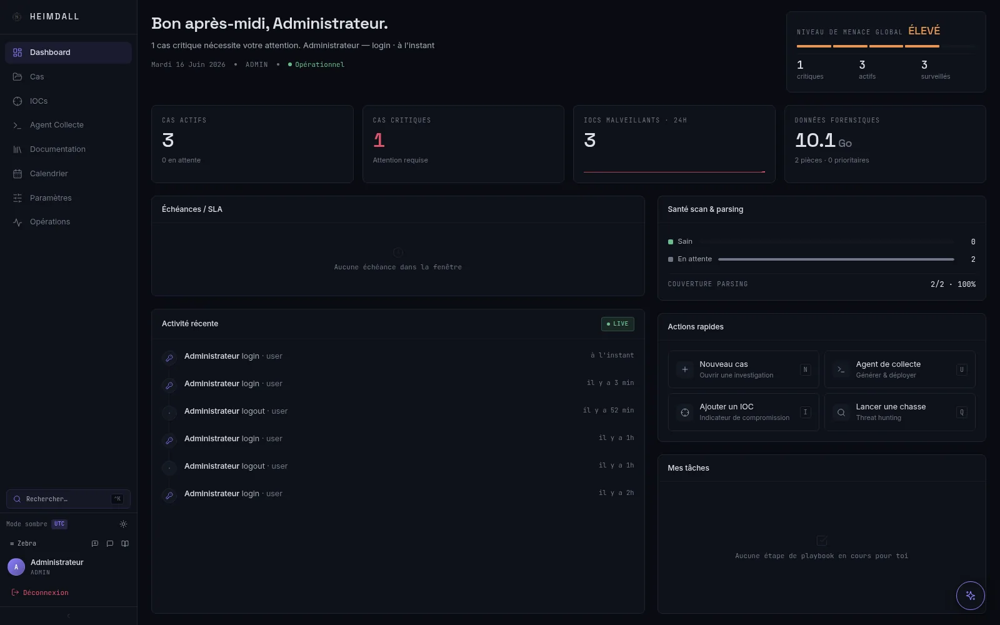

# Heimdall DFIR

Gestion de dossiers, analyse de preuves et threat hunting pour les équipes DFIR, sur une infrastructure auto-hébergée.

[English](README.md) · [Roadmap](ROADMAP.fr.md) · [Documentation](docs/README.md) · [Discord](https://discord.gg/sx7DnNYMNF)



Heimdall rassemble les preuves importées, les timelines, les détections, les notes d'investigation et les rapports dans une même interface web. Le projet s'adresse aux laboratoires, aux SOC internes et aux équipes de réponse à incident qui souhaitent conserver leurs dossiers sur une infrastructure qu'ils maîtrisent.

Le projet est en développement actif. Commencez avec des preuves de test et examinez le modèle de déploiement et de conservation avant de l'utiliser sur une investigation en cours.

## Ce qui fonctionne aujourd'hui

| Domaine | Fonctions disponibles |
| --- | --- |
| Investigations | Dossiers, assignations, notes structurées, constats, questionnaires DFIQ, tableau Kanban et rapports |
| Import des preuves | Collectes KAPE, Magnet RESPONSE, Velociraptor et CyLR ; données CatScale ; fichiers CSV ; téléversements classiques et découpés |
| Travail sur la timeline | Timeline par dossier, recherche plein texte, filtres par champ, regroupement, recherches enregistrées, vue contextuelle, comparaison et export CSV |
| Détection | Chasses YARA et Sigma, règles YAML, résultats Hayabusa, corrélation d'IOC, scores de triage et chasses automatiques après import |
| Réseau et mémoire | Connexions extraites des PCAP, graphes réseau et mouvements latéraux, indicateurs de beaconing, VolWeb et Volatility 3 |
| Travail en équipe | Signets de timeline, chat par dossier, mises à jour en temps réel, suivi de l'investigation, rapports collaboratifs et journaux d'audit |
| Renseignement sur les menaces | Flux TAXII/STIX, import MISP, IOC multi-dossiers et enrichissement optionnel par VirusTotal, AbuseIPDB et HIBP |
| Exploitation | Utilisateurs et sessions, politiques de sécurité et de rétention, état des services, sauvegardes et journaux d'accès |
| Modèle local | Chat et aide à la rédaction via Ollama. Les requêtes restent sur le service Ollama configuré ; les résultats doivent être relus par un analyste |

Heimdall analyse des preuves déjà collectées. Il ne remplace ni un agent de collecte, ni un SIEM, ni une procédure forensique validée. La [roadmap](ROADMAP.fr.md) précise les limites du projet et les travaux encore prévus.

## Architecture

```text
Navigateur
  |
  v
Traefik :80/:443
  |
  +-- Frontend React :3000
  |
  +-- API Node.js :4000
        |
        +-- PostgreSQL        dossiers, utilisateurs, métadonnées et audit
        +-- Elasticsearch     recherche dans les timelines
        +-- Redis / BullMQ    files de travaux, cache et temps réel
        +-- ClamAV            analyse des fichiers importés
        +-- MinIO / VolWeb    preuves mémoire et Volatility 3
        +-- Ollama            inférence locale
```

La définition complète des services se trouve dans [docker-compose.yml](docker-compose.yml). Les preuves importées et l'état de l'application sont conservés dans des volumes Docker ; PostgreSQL reste la source de vérité pour les dossiers et leur workflow.

## Démarrage rapide

### Prérequis

- Docker Engine 24 ou plus récent, avec Docker Compose v2
- `openssl` sous Linux et macOS
- au moins 16 Go de RAM pour la stack complète ; l'analyse mémoire et les modèles Ollama plus grands demandent davantage
- un espace disque adapté aux images, aux index et aux preuves ; 50 Go constituent un point de départ raisonnable pour un lab

### Linux et macOS

```bash
git clone https://github.com/RaiseiX/Heimdall-DFIR.git
cd Heimdall-DFIR
bash start.sh
```

### Windows PowerShell

```powershell
git clone https://github.com/RaiseiX/Heimdall-DFIR.git
cd Heimdall-DFIR
Set-ExecutionPolicy -Scope Process Bypass
.\start.ps1
```

Le script d'installation crée `.env` depuis [.env.example](.env.example), génère les secrets d'infrastructure, construit les images, démarre les services et applique les migrations de base de données.

Après le premier démarrage :

1. Ouvrez `https://localhost`. Le certificat local est auto-signé, le navigateur affichera donc un avertissement.
2. Connectez-vous avec `admin` ou `analyst`. Leurs mots de passe initiaux proviennent de `ADMIN_DEFAULT_PASSWORD` et `ANALYST_DEFAULT_PASSWORD`.
3. Changez les deux mots de passe avant de rendre Heimdall accessible depuis une autre machine.

Ces variables ne sont lues qu'à la création de la base. Les modifier ensuite ne change pas le mot de passe d'un compte existant ; utilisez les paramètres utilisateur dans Heimdall.

### Accès locaux

| Service | Adresse |
| --- | --- |
| Heimdall | `https://localhost` |
| État de l'API | `https://localhost/api/health` |
| VolWeb | `http://localhost:8888` |
| Console MinIO | `http://localhost:9001` |

Pour utiliser un nom de domaine public, renseignez `DOMAIN`, `ACME_EMAIL` et `ALLOWED_ORIGINS` avant le démarrage, puis vérifiez les routeurs Traefik et le résolveur de certificats pour ce domaine. N'utilisez pas la configuration locale auto-signée pour un déploiement public.

## Configuration

Les principaux réglages se trouvent dans `.env`.

| Variable | Usage |
| --- | --- |
| `DOMAIN`, `ACME_EMAIL` | Nom d'hôte externe et adresse d'inscription Let's Encrypt |
| `DB_PASSWORD`, `REDIS_PASSWORD` | Identifiants PostgreSQL et Redis |
| `JWT_SECRET` | Signature des sessions ; dans la stack Compose par défaut, la clé d'audit en est actuellement dérivée |
| `ADMIN_DEFAULT_PASSWORD`, `ANALYST_DEFAULT_PASSWORD` | Comptes initiaux sur une base neuve |
| `ALLOWED_ORIGINS` | Liste des origines CORS autorisées |
| `MINIO_ROOT_USER`, `MINIO_ROOT_PASSWORD` | Identifiants MinIO utilisés par VolWeb |
| `VOLWEB_*` | Connexion à VolWeb et URL publique |
| `GITHUB_TOKEN` | Jeton optionnel pour importer des règles publiques |
| `OLLAMA_URL` | Service Ollama utilisé par l'assistant |
| `DOCKER_GID` | Groupe Docker de l'hôte utilisé par la vue d'exploitation sous Linux |

Ne commitez pas `.env`. Conservez-en une copie protégée si vous devez restaurer le déploiement : ce fichier contient les identifiants nécessaires à plusieurs services.

## Exploitation courante

```bash
docker compose ps
docker compose logs -f backend
docker compose logs -f worker
docker compose logs -f traefik
docker compose restart backend worker
bash db/migrate.sh
```

`docker compose down -v` supprime les volumes persistants de la stack. Sur une installation non jetable, effectuez et testez une sauvegarde avant de supprimer des volumes ou de modifier le stockage.

## Sécurité et traitement des preuves

- Conservez la plateforme sur un réseau de confiance tant que son déploiement n'a pas été revu pour votre environnement.
- Remplacez les mots de passe initiaux et toutes les valeurs temporaires de `.env`.
- Le code accepte une clé `AUDIT_HMAC_KEY` distincte, mais le service Compose par défaut ne la transmet pas encore au backend. Ajoutez cette clé au backend avant de compter sur la séparation des clés.
- Vérifiez TLS, CORS, les limites d'import, l'exposition de MinIO et le pare-feu de l'hôte avant tout accès distant.
- Le backend monte le socket Docker pour la vue d'exploitation. Considérez l'accès administrateur au backend comme sensible pour l'hôte et retirez cette capacité si elle n'est pas utile.
- Une analyse ClamAV ne rend pas un fichier sûr à ouvrir en dehors du workflow d'analyse.
- Les chaînes de hachage du journal peuvent révéler certaines modifications ou suppressions ; elles ne constituent pas, à elles seules, une garantie juridique de chaîne de possession.
- Testez la sauvegarde et la restauration avec des preuves représentatives avant de traiter de vrais dossiers.

## Développement

Backend :

```bash
cd backend
npm install
npm run dev
npm run typecheck
npm test
```

Frontend :

```bash
cd frontend
npm install
npm run dev
npm run typecheck
npm run i18n:check
npm test
npm run build
```

Les images Docker utilisent Node.js 24. Les changements qui touchent l'exécution doivent aussi être testés avec Docker Compose, car les réseaux, les contrôles d'état, les volumes et les délais du proxy font partie de l'application.

## Repères dans le dépôt

```text
backend/      API, services, workers et parseurs
frontend/     application React
db/           schéma, migrations et outils associés
docker/       fichiers de support pour Traefik et VolWeb
docs/         documentation maintenue pour l'architecture et les contributeurs
tasks/        notes d'implémentation et backlog technique
```

Pour aller plus loin :

- [Architecture](docs/architecture.md)
- [Backend](docs/backend.md)
- [Infrastructure](docs/infra.md)
- [Frontend](docs/ui.md)
- [Système de design](docs/design-system.md)
- [Historique des changements](CHANGELOG.md)
- [Guide utilisateur](TUTORIAL.fr.md)

## Projet et communauté

Les questions et retours sont les bienvenus sur [Discord](https://discord.gg/sx7DnNYMNF). Pour signaler un bug ou proposer une évolution, ouvrez une issue GitHub en indiquant la version concernée, les étapes de reproduction et les journaux utiles, après avoir retiré toute donnée sensible. Une vulnérabilité présumée doit être signalée en privé selon la [politique de sécurité](SECURITY.md), jamais dans une issue publique ou sur Discord.

Heimdall repose sur de nombreux projets libres de l'écosystème DFIR, parmi lesquels Zimmerman Tools, Hayabusa, VolWeb, Volatility 3, ClamAV, SigmaHQ, les communautés YARA et MITRE ATT&CK. Vérifiez les licences amont des outils intégrés ou téléchargés avant de redistribuer des images.

## Licence

[MIT](LICENSE) © Contributeurs Heimdall DFIR
