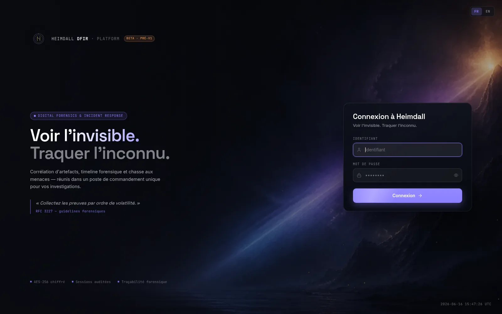
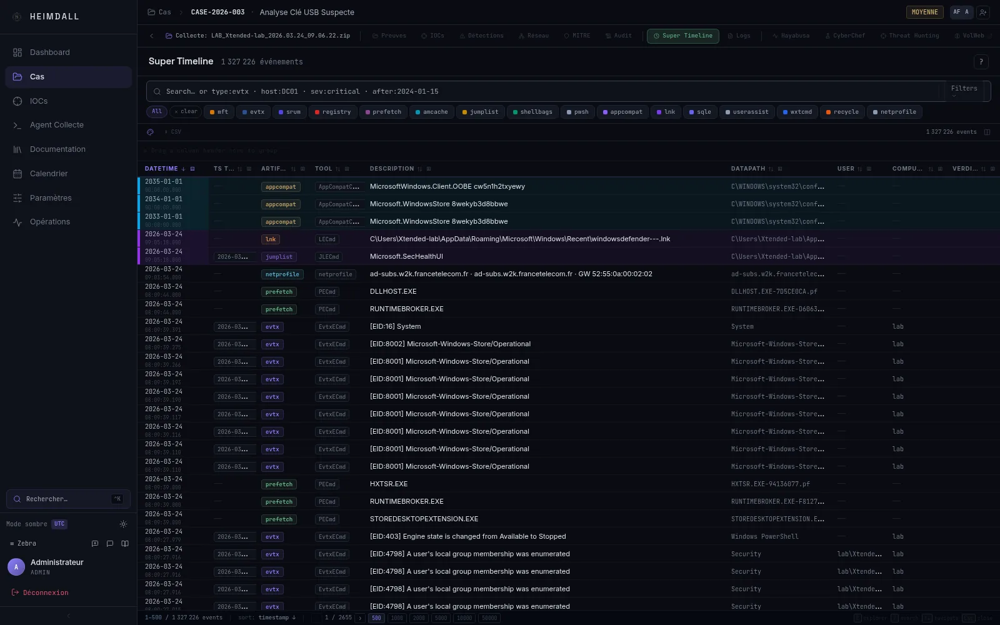
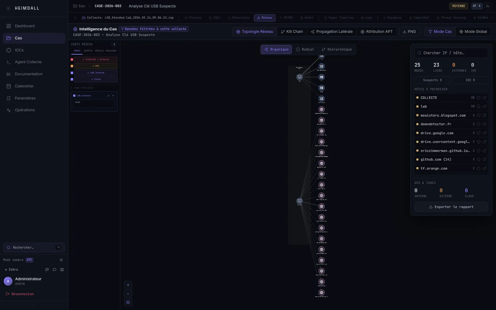

# Heimdall DFIR user guide

[Français](TUTORIAL.fr.md) · [README](README.md) · [Roadmap](ROADMAP.md) · [Security](SECURITY.md)

This guide follows the interface currently available on the `main` branch. Heimdall is still under active development, so use synthetic or disposable evidence while learning the workflow.

The application is designed for a desktop browser. Some labels remain in English when the French interface is selected, and the built-in English forensic documentation is not complete yet.

## 1. Before you begin

For installation requirements and deployment warnings, use the [README](README.md). A local installation starts with:

```bash
git clone https://github.com/RaiseiX/Heimdall-DFIR.git
cd Heimdall-DFIR
bash start.sh
```

On Windows, run `start.ps1` from PowerShell instead. Open `https://localhost` when the stack is ready. The local certificate is self-signed, so the first browser visit normally shows a warning.

The initial users are `admin` and `analyst`. Their passwords come from `ADMIN_DEFAULT_PASSWORD` and `ANALYST_DEFAULT_PASSWORD` in `.env`. Change them from Heimdall after the first sign-in. Editing these variables after PostgreSQL has created the users does not update existing passwords.

Before importing evidence:

- confirm that `docker compose ps` shows the required services as healthy;
- keep the installation on a trusted network;
- start with a small collection that contains no real client or employee data;
- decide whether timestamps should be displayed in UTC or browser-local time under **Settings → Profile**.



## 2. Finding your way around

The sidebar changes slightly according to the signed-in user's role.

| Section | Purpose |
| --- | --- |
| Dashboard | Case activity, deadlines, triage counts and service state |
| Triage | Work queue for alerts and items awaiting review |
| Cases | Create, filter and open investigations |
| IOCs | Global indicator management; shown to administrators |
| Collection Agent | Prepare endpoint collection commands or packages |
| Documentation | Built-in DFIR reference material |
| Calendar | Case deadlines and investigation dates |
| Settings | Profile, sessions, integrations and platform policy |
| Operations | Containers, jobs, backups and health; administrators only |

Use **Settings → Profile** to select English or French, UTC or local timestamps, table density and your chat colour. The interface stores raw forensic timestamps in UTC regardless of the display preference.

`Ctrl+K` or `Cmd+K` opens the global command palette. Inside the Super Timeline, the same shortcut focuses the timeline search field.


## 3. Create a case

Open **Cases**, then select **New case**. Enter:

- a title that identifies the investigation;
- a short description;
- a priority;
- an optional report deadline.

Heimdall assigns the case number and creates it with an active status. Open the new row to reach the case workspace. The header shows the case number, title, priority, status, assignees and deadline. Administrators and team leads can manage assignees.

The case-level tabs are intentionally short:

| Tab | Use it for |
| --- | --- |
| Evidence | Import collections, upload memory and inspect evidence inventory |
| Global Network | Review relationships across the case's collections |
| Investigation | Track phases or Kanban tasks, findings, DFIQ questions and the kill chain |
| Notebook | Keep longer case notes separate from individual timeline events |

The **Actions** menu also contains administrative actions such as legal hold, manifest export and case deletion. Treat these as operational controls, not as a replacement for an organisation's evidence procedure. The current legal-hold state is recorded and audited, but it does not yet block every backend deletion path; enforce the hold through administrator procedure as well.

## 4. Import a forensic collection

From the case's **Evidence** tab, select **Import collection**. The import panel accepts common Windows collection layouts from KAPE, Magnet RESPONSE, Velociraptor and CyLR, and Linux collections produced by CatScale. It can also recognise supported CSV and PCAP material inside a collection.

A normal import looks like this:

1. Drop an archive, a directory, or a set of files into the import panel.
2. Wait while Heimdall uploads and inspects the collection layout.
3. Review the detected artefact families. For a Windows collection, keep only the parsers relevant to the evidence you actually supplied. CatScale uses its Linux pipeline.
4. Start the pipeline and leave the page open while the initial status appears.
5. Read the per-parser result instead of relying only on the total record count.

Parser states have distinct meanings:

| State | Meaning |
| --- | --- |
| Queued | Waiting for a worker |
| Parsing | The parser is running |
| Done | Records were produced or the step completed normally |
| Skipped | The file did not need that parser, was a duplicate, or had no usable mapping |
| Error | The parser failed; inspect the logs before retrying |

A skipped file is not a successful parse, and an empty result is not proof that the source contained no activity. Use the **Logs** tab to see file decisions, parser output and failure reasons. The log can be exported when it is needed for troubleshooting.

When the import completes, the collection appears as a card under **Evidence**. Select the card to enter its collection workspace. Re-parsing replaces derived results for that collection, so review the warning before confirming it.

## 5. Work inside a collection

Each collection has its own navigation strip.

| View | What it shows |
| --- | --- |
| Evidence | Collection summary, record counts and artefact breakdown |
| IOCs | Indicators associated with the current scope |
| Detections | Detection results and supporting events |
| Network | Connections, topology and lateral-movement views |
| MITRE | ATT&CK techniques mapped from available records |
| Audit | Recorded actions for the investigation scope |
| Super Timeline | Searchable event and artefact timeline |
| Logs | Import and parser decisions |
| Hayabusa | Sigma-oriented review of Windows event logs |
| CyberChef | Local data decoding and transformation tools |
| Threat Hunting | YARA, Sigma and combined hunt actions for the collection |
| VolWeb | Opens the separate VolWeb interface for memory analysis |

Counts and detections always depend on what was imported, what parsed successfully and which collection is selected. Check the collection name in the top bar before drawing a conclusion.

## 6. Review the Super Timeline

Open a collection and choose **Super Timeline**. The screen contains a search bar, artefact filters, the event grid, a detail panel and an optional context panel.



### Search and filters

Free text searches the main description, source and artefact type fields. Prefixes narrow a specific field:

| Example | Result |
| --- | --- |
| `host:DC01` | Events associated with one host |
| `user:Administrator` | Events associated with one account |
| `type:evtx` | One artefact family |
| `tool:Hayabusa` | Records produced by a tool |
| `eid:4624` | A Windows Event ID |
| `ext:ps1` | A file extension |
| `tag:T1059` | A tag or technique value |
| `sev:critical` | A detection severity |
| `after:2026-01-01` | Events after a date |
| `before:2026-02-01` | Events before a date |

Press `Enter` to apply a search. The **Filters** menu adds field filters, hits-only mode, severity and deduplication. Artefact pills can be combined; `Ctrl`-click or `Cmd`-click isolates one type. Searches can be saved for yourself or shared with the case.

### Read an event

Select a row to open the detail panel. Its tabs expose normalised fields, MITRE mappings, forensic tags, analyst notes, raw parser data, schema information and, when configured, local-model assistance.

Use the context action to load neighbouring events around the selected timestamp. By default, host context is important: expanding to every host can introduce unrelated activity into a busy case.

Right-clicking a cell offers contains, equals and exclusion filters. Column headers can be dragged into the grouping strip. The **Diff** view compares two collection timelines; confirm both selected scopes before interpreting the result.

Timeline exports reflect the active filters. Record the filters or save the search when the export will support a finding.

Useful timeline keys:

| Key | Action |
| --- | --- |
| `/` or `Ctrl/Cmd+K` | Focus timeline search |
| `Up` / `Down` | Move between rows after selecting one |
| `Escape` | Close the selected row or cancel search input |
| `Ctrl/Cmd+C` | Copy the selected row as CSV |
| `Ctrl+Enter` | Submit an event note while editing it |

## 7. Detections and threat hunting

Detection results are leads. Confirm them against the original record, neighbouring events and the collection's parsing status before promoting them to a finding.

Use the collection views for different questions:

- **Detections** collects rule hits and their supporting records.
- **Hayabusa** focuses on Sigma results produced from Windows event logs.
- **Threat Hunting** runs or reviews the available YARA, Sigma and combined collection hunts.
- **MITRE** groups mapped techniques; a technique match is not attribution to a threat actor.
- The global **Triage** queue helps organise items that still need review.

Rule management and external integrations are available from **Settings** according to role. If a hunt returns nothing, first confirm that the relevant artefact parsed, the rule is enabled and the selected collection contains the expected fields.

## 8. Network and memory evidence

### Network

The collection **Network** view uses imported PCAP connections and supported authentication events. It provides topology, attack-path and lateral-movement views. Select nodes and edges to inspect the records behind a relationship; a connection alone does not prove successful authentication or compromise.

The case-level **Global Network** view combines the available collection graphs. Switch back to collection scope when you need to verify the original evidence.



### Memory

From the case **Evidence** tab, use the **RAM** action to upload a supported memory dump. The current interface streams the multipart upload and shows its progress in the browser. It does not provide the resumable chunk workflow described by older versions of this guide. Practical capacity depends on the browser, proxy, storage and available time; test a representative dump before relying on the workflow.

After upload, the evidence card shows the transfer and VolWeb state. Use **Open in VolWeb** when the item is ready. VolWeb runs separately at `http://localhost:8888` and provides the Volatility 3 plugin interface.

Do not assume that every Volatility result is copied into Heimdall's timeline. Keep the VolWeb result, plugin name and parameters with any finding that depends on memory analysis.

## 9. Build the investigation record

The case **Investigation** tab brings four related records together:

- phases or Kanban tasks for the work still to do;
- structured findings;
- DFIQ question sets and linked evidence;
- a kill-chain view built from the recorded findings.

Use findings for conclusions supported by evidence. Use the **Notebook** for working notes, hypotheses and questions that are not ready to become findings. Event-specific notes belong in the Super Timeline detail panel.

The case chat is available from the case page. Messages and presence help coordinate analysts, but important decisions should also be recorded in a finding, notebook entry or report rather than left only in chat.

The collection **IOCs** view, and the global IOC view available to administrators, allow manual indicators and enrichment where integrations are configured. Record the source and meaning of an IOC; enrichment provider output can change and should not replace the underlying observation.

## 10. Generate a report

The **Summary & Report** area is on the case **Evidence** page. At least one parsed collection is required.

1. Choose a report template or select the sections manually.
2. Add an analyst note when the report needs context that cannot be derived from the stored fields.
3. Review the collaborative narrative sections.
4. Generate the PDF and download it from the completed report state.

If Ollama is configured, Heimdall can prepare a draft. Treat it as editable text, not as a forensic conclusion. Check names, dates, counts, MITRE mappings and every claim against the cited evidence before the report leaves the team.

The audit log and legal-hold manifest serve different purposes. The audit log records application actions; the manifest captures a signed view of the case when requested. Neither proves every part of an external chain-of-custody process on its own, and the current legal-hold implementation is not a complete technical deletion barrier.

## 11. Settings and operations

Every user can manage profile preferences, personal sessions and the integration keys allowed by their role. Administrators additionally see team, roles, audit, security, retention, integrations and SLA settings.

The **Operations** area is restricted to administrators. It exposes service health, job information, backups, Docker state and local-model administration. Because the backend uses the host Docker socket for part of this view, administrator access is sensitive at the host level.

Before using real evidence:

- change initial passwords and review active sessions;
- configure password and lockout policy;
- verify allowed origins, TLS and exposed ports;
- run an audit-integrity check;
- create a backup and perform a restore drill;
- review retention before enabling an automatic purge.

Use the private process in [SECURITY.md](SECURITY.md) for suspected vulnerabilities. Do not place client evidence, credentials or exploit details in a public issue or Discord message.

## 12. Troubleshooting

Start with the service state and the logs for the failing boundary:

```bash
docker compose ps
docker compose logs -f backend
docker compose logs -f worker
docker compose logs -f traefik
curl -k https://localhost/api/health
```

| Symptom | First checks |
| --- | --- |
| Login fails after editing `.env` | Existing account passwords are stored in PostgreSQL; changing the initial variables does not rotate them |
| Collection produces no events | Open **Logs**, review skipped/error files, confirm the artefact selection and verify the collection scope |
| Parser remains queued | Check `worker`, Redis and PostgreSQL health |
| Timeline looks empty | Clear filters, confirm the collection name and review parser record counts |
| Hayabusa has no results | Confirm EVTX files were detected and parsed; an empty result can also mean no enabled rule matched |
| VolWeb does not open | Check `hel-api`, VolWeb workers, MinIO and port `8888` |
| Local assistant is unavailable | Check Ollama service health and whether a model is installed |
| Browser shows a certificate warning | Expected for the local self-signed certificate; public deployments need reviewed Traefik certificate settings |

When reporting a normal bug, include the affected commit or installation date, exact steps, the selected case/collection scope and sanitised logs. Never attach real evidence unless a private transfer method has been agreed.

## 13. Short workflow examples

### Windows collection

1. Create a test case and import a small KAPE, Magnet, Velociraptor or CyLR collection.
2. Review detected artefacts before starting the parsers.
3. Check **Logs** for skipped and failed files.
4. Open the **Super Timeline** and filter by host, Event ID or tool.
5. Review detections in context and record supported conclusions as findings.
6. Generate a draft report, review it, then export the PDF.

### Linux collection

1. Import a CatScale archive.
2. Confirm that the collection is identified as Linux.
3. Review the CatScale parsing states and record counts.
4. Use timeline filters such as `host:`, `user:` and artefact pills.
5. Review Linux detection tags against the original log lines before creating findings.

### Memory investigation

1. Upload a test dump through the **RAM** action.
2. Wait for the evidence card to show that VolWeb is ready.
3. Record the Volatility plugin and parameters used for each relevant result.
4. Correlate timestamps and identifiers with other collection evidence where possible.
5. Add the supported conclusion to the investigation record and report.

For planned features and known gaps, see the [roadmap](ROADMAP.md).
